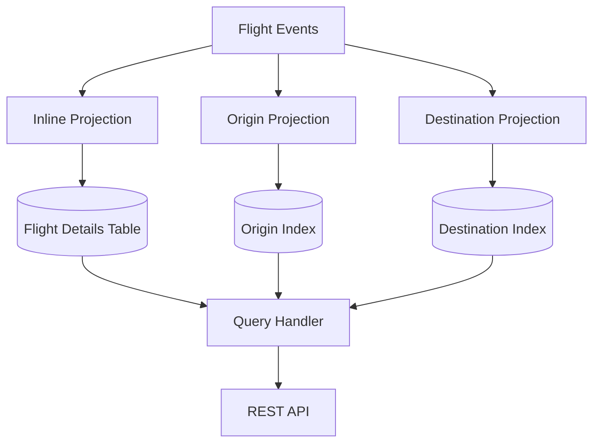

# Flight Management System with Axon Framework and Micronaut

This project demonstrates integration of Axon Framework with Micronaut for event sourcing and CQRS, using Postgres as the event store and projection database. The application is a flight management system that allows scheduling, delaying, and canceling flights.

## Overview

This playground project showcases various Axon Framework features in a Micronaut environment. The system uses event sourcing to track and record all changes to flights, enabling accurate historical views and robust projections.


## Key Features

### Command Processing with Decider Pattern
The system uses the Decider pattern to separate decision logic from state changes in the aggregate. This provides a clean separation of concerns and makes reasoning about the system easier.

Location: [Flight Aggregate](./src/main/kotlin/com/playground/aggregate/FlightAggregateOption3.kt)


### Event Sourcing
All state changes are recorded as events, providing a complete audit trail of all operations on flights.

### Projections
The system includes several types of projections:

1. **Inline Projection** - Updates the read model in the same transaction as the event is processed
   Location: [Flight Details Projection](./src/main/kotlin/com/playground/projections/FlightDetailsInlineProjection.kt)

2. **Origin Projection** - Maintains a list of flights by origin airport
3. **Destination Projection** - Maintains a list of flights by destination airport



### Query Handlers
Location: [Flight Details Query Handler](./src/main/kotlin/com/playground/queries/FlightDetailsQueryHandler.kt)

### REST API
The system provides a REST API for flight management operations:
- Schedule new flights
- Delay flights with reasons
- Cancel flights with reasons
- Query flights by ID, origin, destination, or get all flights

Location: [Flight Controller](./src/main/kotlin/com/playground/FlightController.kt)

## Getting Started

### Prerequisites
- JDK 17+
- Docker and Docker Compose (for Postgres)
- Gradle

### Running the Application

1. Start Postgres:
```bash
docker-compose up -d postgres
```

2. Build and run the application:
```bash
./gradlew run
```

3. The application will be available at http://localhost:8080

### Environment Variables for Axon Console

To connect to Axon Console, set the following environment variables:

```
AXON_CONSOLE_CREDENTIALS=your_credentials_here
AXON_CONSOLE_CLIENT_ID=your_client_id
AXON_CONSOLE_CLIENT_SECRET=your_client_secret
```

### Testing

#### Unit Tests

Run unit tests with:
```bash
./gradlew test
```

#### Load Testing

The project includes Gatling load tests to simulate high traffic scenarios:
```bash
./gradlew gatlingRun
```

Location: [Flight Simulation](./src/gatling/kotlin/simulations/FlightSimulation.kt)

## API Usage Examples

You can find example API calls in the [flights.http](./flights.http) file, which can be used with the IntelliJ HTTP client or other tools like curl.

### Basic Operations:
- Schedule a new flight
- Delay a flight with a reason
- Cancel a flight with a reason
- Get flight details
- Get all flights
- Get flights by origin or destination

## Technical Implementation

### Implemented Features

- ✅ Live projections (using event store to read events directly)
- ✅ Subscribing event processor (same Unit of Work)
- ✅ Streaming event processor (background thread)
- ✅ Snapshots for event sourcing performance
- ✅ Sagas for complex, long-running processes
- ✅ Transactions across multiple operations
- ✅ Micronaut Aggregate Factory
- ✅ Micronaut Saga Factory
- ✅ Connection leak fixes
- ✅ Decider pattern implementation
- ✅ I/O in streaming projections:
  - ✅ Scheduled Flights by Origin
  - ✅ Scheduled Flights by Destination
  - ✅ Flights delay count and status
- ✅ Query handlers for all projections
- ✅ Axon Console integration
- ✅ Projection replaying (streaming)
- ✅ Multi-node projections with leadership
- ✅ Projection scaling through sharding
- ✅ Load testing

### Future Improvements

- 📝 Transaction Manager integration with Micronaut Data

## Testing DSL

The project includes a custom Kotlin DSL for testing the API in a fluent, readable manner:

```kotlin
@Test
fun `when scheduling a flight it eventually appears in the flights by destination list`() {
    val destination = "SYD"
    val scheduled = flightApi.scheduleFlight(destination = destination)
    
    flightApi.awaitFlightByDestination(destination, scheduled.flightId)
    
    val otherDestinationFlights = flightApi.getFlightsByDestination("CDG")
    Assertions.assertTrue(otherDestinationFlights.flights.isEmpty())
}
```

## Architecture Decisions

### Event Sourcing
We chose event sourcing to maintain a complete audit trail of all flight operations. This enables time travel queries and rebuilding projections.

### CQRS
The Command Query Responsibility Segregation pattern separates write operations (commands) from read operations (queries), allowing for independent scaling and optimization.

### Eventual Consistency
Projections are eventually consistent with the event store, which allows for high scalability but requires careful testing to handle the consistency delay.

## Additional Resources

- [Axon Framework Documentation](https://docs.axoniq.io/reference-guide/)
- [Micronaut Documentation](https://docs.micronaut.io/latest/guide/)
- [Decider Pattern Readme](./src/main/kotlin/com/playground/aggregate/README.md)